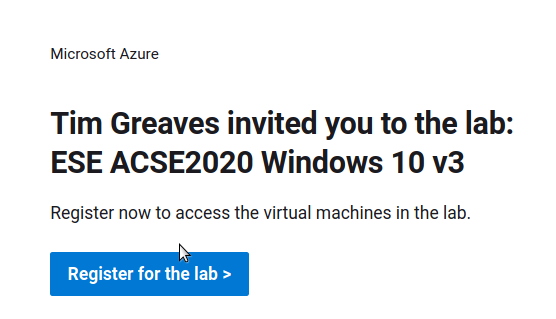
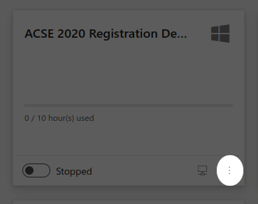
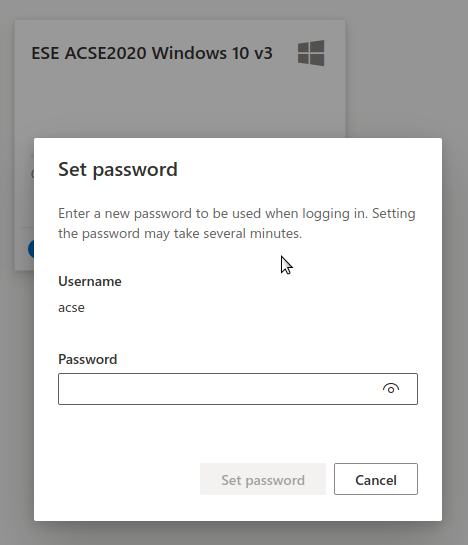
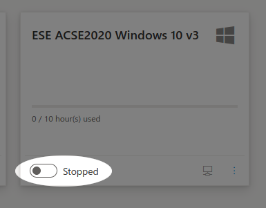
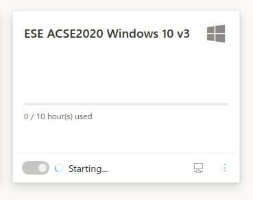
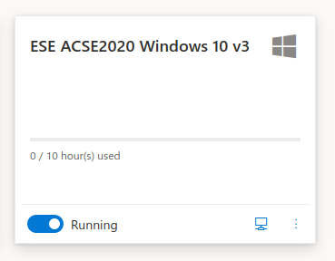
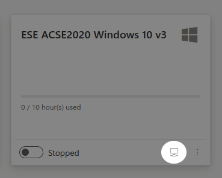

# Azure Labs

## Introduction

### What is the Azure Labs service?

[Azure Labs](https://labs.azure.com/) is a Microsoft cloud service which provides a virtual computer laboratory in which virtual machines are available to students at any time and from any location. The virtual machines for ACSE are created from a template which is configured with Windows 10, preinstalled with a full suite of [the required course software](../software/intro.md), and allows students to work independently of the physical computer they're accessing Labs from. This avoids problems with software on the local system being misconfigured or absent.

Students access their assigned virtual machine using Remote Dekstop, giving access either in the form of a windowed application or as a full-screen overlay to give the experience of working on the Labs system as if it were local to the user.

Each module and miniproject in the ACSE course will have an associated Azure Lab, which students will be invited to register for by email prior to the module or miniproject commencing. **The virtual machines allocated to students will be reset between modules, removing all user data**, so it is critical that any data students wish to retain is transferred off the virtual machine. OneDrive is recommended as an easy way to do this, and all Imperial College users will get an Imperial One Drive which can be used for this purpose. 

## Time and resource limits of Labs use

Virtual Machines provided by Azure Labs need to be started when they are required, and stopped when they are not being used. Students are allocated a set number of running hours when they are invited to a Lab, and are responsible for starting and stopping their virtual machine at the start and end of their work. This is a best-practise habit which is applicable to cloud use in general, and students are encouraged to adopt it in order to minimise running costs.

The allocated time should be sufficient to carry out all the work associated with the module or miniproject, but in exceptional cases extra time may be allocated at a tutor's discretion.

Each virtual machine will typically have four cores, 16GB RAM, and 30GB local storage attached to it for the student's sole use. When working with larger datasets students should be aware of memory and storage limits, and may find they need to remove very large files between exercises to release storage capacity. It is reiterated that any data which needs to be retained after the end of a module or miniproject should be stored in the cloud, off the virtual machine, preferably in the student's Imperial College OneDrive. 

## When and why should you use Azure Labs

Many students will prefer to use their own laptop or desktop computer for work during the ACSE course, but some students may either prefer not to install extra software on their local computer, or not have sufficient administrative rights to do so. Some students may not have sufficent local resources to run the larger course exercises, or may experience problems with their local computer that prevent them from working. 

The Azure Labs service is intended to provide a remote computing option to by-pass all of these issues, and requires only that students have a computer and network connection sufficient to connect to the Labs service using Remote Desktop Protocol. Almost all modern systems should be capable of a Remote Desktop connection, and any connection suitable for live streaming tutor presentations, a prerequisite for participating in the ACSE course, should be capable of handling the associated data requirements for Labs.

Even if you intend to primarily use your local computer for course work, it is recommended that you have a basic familiarity with Labs in case you need it unexpectedly as a back up work environment.

## Registering for a lab

Before each module or miniproject, you will receive an invitiation to the associated Azure Lab, sent to your Imperial College email address. This will provide you with a link to follow, which may require you to authenticate with Azure using your Imperial College user account if your browser does not already have a saved authentication session.

### Setting a password

You can see all live labs in which you have an allocated virtual machine by going to the [Azure Labs Virtual Machines](https://labs.azure.com/virtualmachines/) page, which will require you to be logged in to Azure using your Imperial College Account. For each lab you are registered with you will see a tile allowing you to manage the virtual machine associated with that lab.

Before your first connection to an Azure Labs virtual machine you will be required to set a password. To do this, go to the [Virtual Machines landing page](https://labs.azure.com/virtualmachines/) and click on the actions button for your virtual machine:

then select 'reset password' from the actions menu. Enter a new password when prompted, and then wait whilst the password is reset. 

While the password is being reset you will not be able to start or connect to your virtual machine, and you should see a notification that the password is being reset. Wait for this notification to clear before starting and connecting to your virtual machine.

## Connecting to a virtual machine

Before connecting to a virtual machine you need to start the virtual machine using the switch at the lower left corner of the virtual machine pane.

The virtual machine tile should now show that the virtual machine is starting.

Once the start up process is complete, the tile should show you that the virtual machine is running.

### Connecting using Remote Desktop Protocol

Clicking on the connect button on the [Virtual Machines](https://labs.azure.com/virtualmachines/) landing page:

will provide you with a Remote Desktop Protocol (RDP) configuration file. Most modern operating systems will be preconfigured with a client to open this configuration file, but if you do not have one, the [Microsoft Remote Desktop client](https://docs.microsoft.com/en-us/windows-server/remote/remote-desktop-services/clients/remote-desktop-clients) is available for Windows and Mac OS X, and [Remmina](https://remmina.org/how-to-install-remmina/) is available pre-packaged for most Linux distributions.

If the configuration file does not automatically supply a username, the default username for all course Labs machiens is 'acse'.  Use the password you set in the previous step.

You may be prompted to trust the virtual machine you are connecting to, including accepting a certificate; this is a required step, so unless you have specific security concerns during the connection process you will need to 'OK' all trust dialogues.

### Setting up Teams and OneDrive

Once you have connected to your Labs virtual machine, you will be prompted to connect to Teams, for which you should use your Imperial College username and password to authenticate. Some systems may not support audio output from the remote Teams client, and most will not support audio (microphone) input, so this is mostly provided to allow you to participate in chat and file exchange via teams. It is assumed that you will have a local Teams client for live streaming course presentations.

You are strongly encouraged to connect your Virtual Machine to your Imperial College OneDrive account, both to store older data and free up space on the virtual machine, and also to store any data that you want to retain at the end of each course module or miniproject. **Note that at the end of each module or miniproject lab, virtual machines are reset and all user data is removed**.

To connect your virtual machine to OneDrive, click on the OneDrive icon in the system tray at the lower right hand corner of your virtual machine session, and enter your Imperial College username and password when prompted. If the OneDrive icon is not present, you may need to run the OneDrive app from the 

## Stopping a virtual machine

You will be allocated a set number of hours use of your virtual machine in Labs for each module or miniproject during the ACSE course. This is intended to cover your active use of the Labs virtual machine, but it is important that you ensure your virtual machine is stopped when you are no longer using it. If you do not do this, it will continue to run and use up your allocated hours. To ensure a clean and successful shutdown, it is recommended that you shut down the Windows operating system that your virtual machine is running from inside the virtual machine, and then go back to the [Virtual Machines](https://labs.azure.com/virtualmachines/) landing page and use the switch available there to ensure your virtual machine has stopped. This is the same switch you used to start your virtual machine, and should go from a running state:

through a 'stopping' state to a stopped state:

