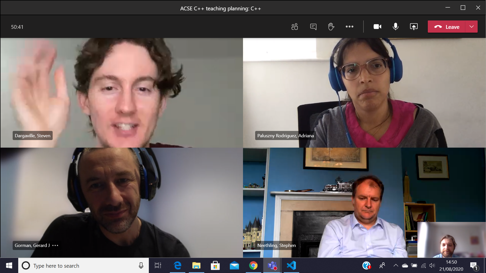
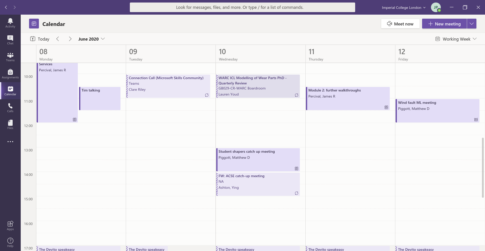

# Microsoft Teams

## A collorative communication. meeting and presentation tool

The Applied Computational Science & Engineering MSc uses [Microsoft Teams](https://www.microsoft.com/en-gb/microsoft-365/microsoft-teams/group-chat-software) as its video meeting and instant messaging app. The Teams desktop app is available on Windows, Mac & linux, and the mobile app is available on iOS and Android, with download links available from the links above.

You will need to be added to the ACSE20 Team before you are able to interact with your peers (you can expect this to happen in September), however it may be worth downloading the app beforehand to get used to the interface if you haven't used it previously.

## Features

Teams offers a number of features you will get familiar with during the course.

### Meetings

Teams allows ad hoc and scheduled video meetings for any number from two to 300. Partipants can speak, send text chat, stream video from their web cams or share their screens. This will be the delivery mechanism for most lecture material on the course. Depending on format, meetings can include interactive online whiteboards, notes or other applications.

### Team Channels

Teams Channels provided a forum for announcements and text-based conversations with reply threads, as well as hosting channel-wide video meetings. This will be the venue to ask (and answer) questions about wider course content, issues with practical exercises and social interaction. The threads are ordered by time of last comment with most recent last. Channel notifications can be turned on or off in the user settings, but are _off_ by default.

### Live Chat

Live Chat allows private text, audio or video conversations between members of the college, from two to 20. Conversations are _not_ threaded, with the messages shown in the order they were written. 

### Calendar

The calendar tab shows and schedules events in your college Outlook calendar. This is where course lectures and pre-arranged meetings you are involved with will appear.

## Keyboard commands and shortcuts

Microsoft Teams supports a number of quick commands, of the form `/chat`, `/unread` etc  which can be entered into the search menu at the top of the interface. A full list of possible options will appear when you first type `/`. Some of the most useful are

|Command  |Action                      |
|:-------:|:--------------------------:|
|/chat    | Switch to new chat message |
|/unread  | List unread notifications  |
|/find    | Search channels for keyword|
|/testcall| Check your audio setup     |

The app also supports a wide number of keyboard shortcuts. Microsoft provides a list of all possible shortcuts for Windows/Linux [here](https://support.microsoft.com/en-us/office/keyboard-shortcuts-for-microsoft-teams-2e8e2a70-e8d8-4a19-949b-4c36dd5292d2#picktab=windows) and for Mac OS [here](https://support.microsoft.com/en-us/office/keyboard-shortcuts-for-microsoft-teams-2e8e2a70-e8d8-4a19-949b-4c36dd5292d2#picktab=macOS). Some of the most useful are

|Action                | Windows          | Mac OS              |
|:--------------------:|:----------------:|:-------------------:|
|List shortcuts        | ctrl + .         | &#8984; + .         |
|Mute/unmute microphone| ctrl + shift + M | &#8984; + shift + M |
|Turn camera on/off    | ctrl + shift + O | &#8984; + shift + O |
|Start new chat        | ctrl + N         | &#8984; + N         |
|Attach file           | ctrl + O         | &#8984; + O         |
|Use search bar        | ctrl + E         | &#8984; + E         |
|List commands         | ctrl + /         | &#8984; + /         |

## Resources

- Microsoft's Teams [video tutorials](https://support.microsoft.com/en-gb/office/microsoft-teams-video-training-4f108e54-240b-4351-8084-b1089f0d21d7)
- A Tech Republic [article on using Teams productively](https://www.techrepublic.com/article/microsoft-teams-the-smart-persons-guide/)
